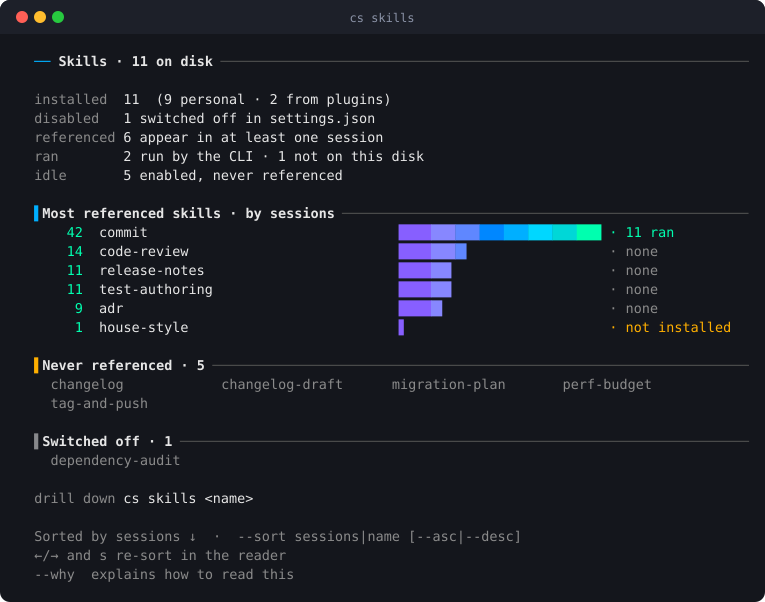
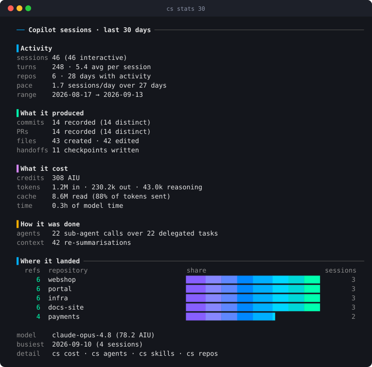
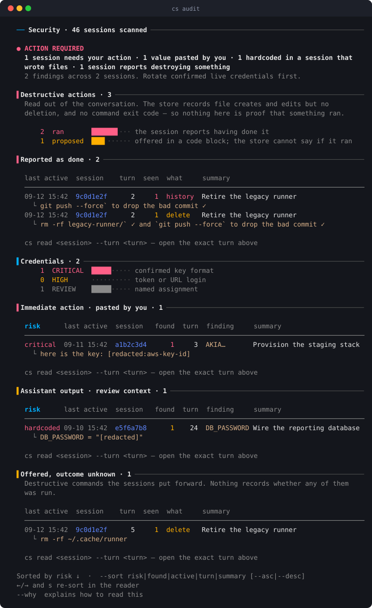
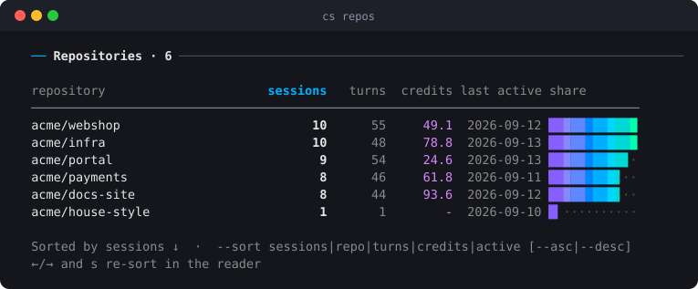

<div align="center">

# `cs` — Copilot Sessions

**A terminal app for everything your GitHub Copilot CLI already remembers.**
Browse, search, read, audit and resume any past session — without leaving the shell.

[](https://github.com/smaharajan/copilot-sessions/actions/workflows/ci.yml)
[](LICENSE)
[](https://www.python.org/)
[](#-install)
[](#-privacy)
[](#-privacy)

</div>

Nothing you did with Copilot is actually lost. Every turn, every file it
touched, every credit it spent is sitting in a SQLite file on your disk right
now. What you don't have is a way to *look*.

`cs` is that way — a full terminal application over the session store, with a
home screen, arrow-key navigation, live filtering, and a view for each question
you actually ask. It never writes to the store, makes no network calls, and
needs nothing beyond Python itself.

> **Every screenshot below is a real run**, produced by
> [`docs/img/make_screens.py`](docs/img/make_screens.py) against a synthetic
> store. Nothing here is a mock-up, and nothing here is anybody's real session.

---

## 🖥️ Run it with no arguments and it is an app

```
                                  ___ ___
                                 / __/ __|
                                | (__\__ \  copilot sessions
                                 \___|___/
  2,480.5k AIU · 420 sessions · 5,120 turns · 12 repos · 11/30 skills · 4/6 agents · 2 mcp
  ↻ last  Refactor cart service · acme/webshop · 2h ago · ⇥ Tab resumes
  activity ▂▂▁  ▁▃  ▂▂▂▁▂▂▅▂▁  ▂▂▂▂▃▂  ▃▁▂▁  ▂▆▂▄▁ ▁▂▃▃▂▃ ▂▂▄▃▄▂▁ ▅▄▃▂▄ all time · since 9 Mar 2026
  ────────────────────────────────────────────────────────────────────────────────────────────
   ▌FIND  ──────────────────────────────────────────────────────────────────────────────────
  ▌  🕒  Recent sessions   browse, read and resume · last 7 days
     📌  Pinned            sessions you marked to keep handy
     📚  All sessions      every session ever recorded · scroll to browse
     🔍  Search            full text across every turn and checkpoint
     📦  Repositories      sessions grouped by repository
   ▌MEASURE  ─────────────────────────────────────────────────────────────── last 30 days ──
     📊  Stats             commits, PRs, files and what they cost
     💰  AI spend          credits by model, repository and day
     🔋  Efficiency        cache, rate multiplier, latency, reasoning
     👥  Delegation        you vs the main agent vs sub-agents
     🐝  Sub-agents        which agents ran, on which models, how long
     🔀  Model switches    model or effort changed mid-run, cost either side
   ▌GOVERN  ──────────────────────────────────────────────────────────────── last 30 days ──
     🚀  Autonomy          which sessions ran unattended · YOLO · all time
     🔗  Handoffs          work passed from one session to the next · all time
     🔐  Security          credentials found in session text
     💥  Tool failures     which tools fail, where, worst sessions
     🌀  Stuck loops       one tool failing again and again, with turns
   ▌REFERENCE  ─────────────────────────────────────────────────────────────────────────────
     🎓  Skills            what Copilot can load here, what was used, when last
     🤖  Agents            the same for your agents, and whether their model held
     📋  Instructions      what every session here is told before you type
     🔔  Hooks             what runs around a session, how often it fails, what's missing
     🔌  MCP servers       tool sources wired up, and which were used
   ↑↓ move · ↵ open · ←→ window 30d · t theme Dark · ? help · updated 12:00 · / search · q quit
```

Arrow keys move, `Enter` opens, `/` filters, `Esc` goes back — and **every view
returns here**, so nothing is a dead end. `Tab` resumes the last session named
under the counts, `t` opens the themes, `?` the help, and the menu starts on
the row you opened last. The layout is width-aware: columns
retire in a fixed order as the window narrows, so a view still reads at 60
columns instead of wrapping into rubble.

Press `t` on the home screen for a mouse-and-keyboard
live-preview picker with 20 curated palettes, including Dark, Light, High
Contrast, Nord, Dracula, Solarized, Gruvbox, Tokyo Night, Catppuccin, Kanagawa,
Rosé Pine and Cyberpunk. Hover or single-click previews; `Enter` or double-click
applies and returns to the main page; `Esc` cancels the preview. **The theme
you apply is remembered** — it is written to `~/.config/cs/settings.json` and is
what the next `cs` starts in, so the picker is somewhere you go once rather than
every run. `CS_THEME=<name>` still overrides it for the run it is set on, and
`CS_CONFIG_HOME` or `XDG_CONFIG_HOME` moves the file. The complete
home screen — including total AI credits and a visible refresh timestamp — is
rebuilt from the read-only SQLite store every 60 seconds, and **so is an open
session listing**: start a session in another window and it appears in the list
you are already looking at. A session that is already listed keeps its `#N`, so
`cs resume 3` still means what it meant when you read it; a new arrival takes the
next free number. Search results are left alone, since re-ranking a result set
under the reader is not a refresh.

Home credits show two decimal places rather than rounded `k` totals, so small
new charges remain visible. They stay visible first as the window narrows.

**Pins and a daily budget** live in the same settings file. `cs pin <ref>`
keeps a session on a Pinned home row (and floats it to the top of listings;
press `p` in a listing to toggle). `cs budget 5` sets a daily AIU limit. The
home header shows today's spend against it and turns amber near the limit,
rose when over. When a session is running, a live strip under the counts
shows its title, burn rate, budget left, last tool and last failure, and a
short sparkline of the last ten minutes. It refreshes about every five
seconds. The 60-second rebuild of the rest of the screen is unchanged.

On legacy ncurses builds, terminals with native SGR mouse reporting (such as
Ghostty) use xterm-compatible decoding inside `cs`; the original terminal
setting is restored before returning to the shell or launching another app.

The facts line reads **used over installed**. `11/30 skills` means eleven of
your thirty were ever reached for; the other nineteen are quietly rotting.

---

## ✨ What you get

### 🎓 Which of your skills and agents are earning their keep

Everyone accumulates skills. Nobody knows which ones they use. `cs skills`
counts every root Copilot actually loads from — yours, this repository's, the
**enabled** plugins', the ones the CLI ships — charts them by how many sessions
reached for each, and tells a skill the CLI **demonstrably loaded** (`· N ran`,
recorded in the turn) apart from one merely named in a prompt (inferred),
because those are two different claims.



A skill switched off in `settings.json` gets its own heading rather than being
filed as neglect, and one that ran but is not installed here still gets a row —
named with the checkout that ships it where the store knows of one.

`cs skills <name>` then lists the sessions that used it, and `cs skills
--by-repo` regroups the whole thing by where each skill was reached for,
marking the ones a checkout used but does not carry. `cs profiles` does the
same for agents you have defined, `cs mcp` for tool servers, and `cs hooks`
resolves every hook command against the disk to find the ones pointing at a
script that no longer exists.

### 📋 What your agent is told before you type a word

Copilot truncates an instruction file past 4,000 characters, so the end of a
long `AGENTS.md` is simply never read. `cs instructions` reads both scopes —
this repository's and your personal one — and says which files are over the
line, and by how much.


### 📊 What the work produced, and what it cost

Not "you spent 308 AIU" — *what you got for it*: commits, PRs, files, handoffs,
cache, delegation, and the repositories it landed in, over any window.



A total you cannot decompose is a total you cannot act on, so `cs agents`
splits the spend by **who initiated it**. The share with no prompt of yours
behind it — context being re-summarised, and agents you delegated to — is the
part that surprises people.


`cs efficiency` then asks whether it had to cost that: cache hit rate,
first-token latency, reasoning share, per model.


### 🎯 Daily brief and practice

`cs standup` (alias `daily`) is an offline daily brief over the last day —
sessions, turns, spend, what moved, handoffs, and light autonomy risks when
cheap to ask. `cs coach`, `cs rhythm`, `cs context`, `cs health`,
`cs patterns` and `cs cleanup` are commands; the home screen has no Improve
group.

### ☀️ Today, and finding the work again

**`cs today`** is where you are, on one page (it is not on the home screen): the
session running now (its name, the last ten minutes, and today's budget), the
top sessions to pick up (each with its reason and `cs resume`), what happened
since midnight, and this week against the week before. Empty sections are
left off the page. **`cs next`**, **`cs eod`** and
**`cs weekly`** (both of the last two take `--md`) are still the separate
commands. `cs budget --check` prints one line and exits 1 when over, for
hooks and scripts; the home header shows the same limit.

Finding past work: **`cs search --save`** and **`cs saved`** keep the
searches you run every week. **`cs files <path>`**
lists sessions that touched a file. **`cs cleanup`** lists stale pins, quiet
`wip` tags and abandoned handoffs, and ends with the commands that would tidy
them — it never removes anything itself.

### 🔬 Looking closer

**`cs anomalies`** flags days and sessions that cost more than twice the
median of the fortnight before, shows the shape of the window, and gives one
card per spike with the turns that drove it. **`cs health`** is a short
verdict for the repository you are in, with the few commands worth running.
**`cs patterns`** is one comparison of how you open a session against how it
turns out; a habit with fewer than five sessions on either side is hidden.
`cs skills` and `cs profiles` gain *invoked*, *last used* and — for agents —
whether the declared model held. **`cs switches`** groups each model or
effort change under its session and shows the spend either side.

### 🩺 Running it with confidence

The session running now is on the home screen, not a separate command.
**`cs doctor`** checks what cs depends on — Python, the store and its schema,
the event logs, the config and cache directories, the terminal, the mouse
protocol and the glyph mode — and prints pass, warn or fail with a fix for
each. If Copilot changes its schema under cs, the home screen's status line
says `schema changed · cs doctor`. **`cs rollup`** is a readable report of
counts and rates, with repositories replaced by salted hashes; **`cs rollup
--json`** is that same reading for a pipe.

### 🧾 What actually happened in a session

Copilot's per-session event log records what the store does not, and `cs`
reads it (read-only, counts only, cached): **`cs failures`** — which tools
fail, by tool, by repository and by session; **`cs failures --loops`** — one
tool failing three or more times in a row, with the turns it happened on;
**`cs endings`** — sessions whose last call ended in an error, the length
limit or a content filter; **`cs subagents`** — which agents ran, on which
models, and whether a declared `model:` was ever applied; **`cs switches`** —
model or effort changes mid-run and the spend either side. `cs hooks` gains
how often each lifecycle event ran and failed, and `cs yolo` labels its
evidence **recorded** (allow-all switched on, per the log) or **inferred**.

### 🔐 Prove it was safe

Masking hides a secret on screen but leaves it in the store. `cs audit` scans
turns, checkpoints *and* sensitive file paths (last 30 days by default; `all`
for the whole store) to answer the question masking cannot — **which
conversations hold a credential at all** — and leads with who pasted it,
because that is what decides whether you rotate or shrug.



`risk` is **certainty, not value**: `cs` can say how sure it is that something
*is* a credential, never what it opens. No value is ever printed — only the
name, a public prefix, and masked evidence. A finding is called `hardcoded`
when it reads as source *and* the session wrote a file — a password in a
config is a different problem from one quoted in a sentence.

The same page answers what a session **took away**: files removed, history
rewritten, a database dropped, infrastructure torn down. The store keeps no
delete event and no exit code, so that is read out of the conversation and
split in two — what the session reports having done, and what it merely
offered to do.

Beside it, `cs yolo` shows which sessions ran unattended and on what evidence,
and `cs handoff` follows work passed from one session to the next.

### 🔎 Find the session you only half-remember

Sessions grouped by day and numbered, sortable on any column, with full-text
search across every turn and checkpoint. Or come at it from the other end:
`cs files src/checkout.py` walks back from a file to every session that touched
it, and `cs repos` groups the whole store by repository.



### 📦 Read a session without reopening it

`cs show` reads a thousand-turn session *for* you, and leads with the only part
that changes what you do next:

```
  Still open
    → Immediate (in-flight): wire the deploy job to the staging environment.
    → Confirm the release tag convention: `git tag --list 'v*' | tail -3`

  First request · turn 0
    migrate the existing build jobs to github actions — review how the
    current deployment works first, then port it step by step …

  Shipped
    commits  1a2b3c4, 5d6e7f8
    PRs      #128
```

Then `cs read` for the conversation itself, paged, with `--turn N` for a single
turn and `cs export` for Markdown or JSON.

### ▶️ Pick it back up

`cs resume #3` `cd`s to the right directory and hands you to
`copilot --resume`. One keystroke from a listing — no UUID, no hunting.

> **Every inference carries the evidence that produced it.** No view asks you
> to take its word for anything, and `--why` turns on the paragraph explaining
> how a reading was arrived at.

---

## ⚡ Install

### Homebrew (recommended)

Needs [Homebrew](https://brew.sh) itself. If you don't have it:

```bash
/bin/bash -c "$(curl -fsSL https://raw.githubusercontent.com/Homebrew/install/HEAD/install.sh)"
```

Then install `cs` — **use the full `owner/tap/formula` name**, which taps and
installs in one step:

```bash
brew install smaharajan/tap/copilot-sessions
```

Check it worked:

```bash
cs --version        # cs 1.1.0
cs recent           # your sessions from the last 7 days
```

Homebrew builds `cs` into its own virtualenv with its own Python, so it never
touches your system Python and needs nothing else installed.

**Keeping it current**

```bash
brew update && brew upgrade copilot-sessions
```

**Removing it**

```bash
brew uninstall copilot-sessions
brew untap smaharajan/tap          # optional: forget the tap too
```

> [!IMPORTANT]
> **Tap first and the install will be refused.** Homebrew 6 will not load a
> formula from a third-party tap you have not trusted, so the familiar
> two-step fails:
>
> ```console
> $ brew tap smaharajan/tap && brew install copilot-sessions
> Error: Refusing to load formula smaharajan/tap/copilot-sessions from untrusted tap smaharajan/tap.
> ```
>
> The one-liner above avoids this — naming the tap explicitly is itself the
> trust signal. If you would rather tap first, trust it once:
>
> ```bash
> brew trust smaharajan/tap
> brew install copilot-sessions
> ```

<details>
<summary>Other ways to run it — no Homebrew needed</summary>

Requires **Python 3.10+**. Standard library only, no dependencies.

```bash
git clone https://github.com/smaharajan/copilot-sessions.git
cd copilot-sessions
./install.sh                 # symlinks `cs` into ~/.local/bin

pip install .                # installs the `cs` command
python -m cs recent          # run straight from a checkout
```

If `cs` runs but reports a version you did not install, something earlier in
your `PATH` is shadowing it — `which -a cs` will show you what.
</details>

---

## 🚀 Quick start

```bash
cs                 # the home screen — every view is one keypress from here
cs search cache    # full-text across every turn and checkpoint
cs read #3         # read the third session in the last listing
cs resume #3       # jump back into it
```

You will rarely need more than that. **The home screen reaches every view**,
and every view comes back to it; the commands exist for when you already know
where you are going, or want the readings in a script.

Listings number their rows so you never copy a UUID. `#N` identifies the
**session**, not the row — sorting moves a row around the screen, but its
number travels with it — and any unambiguous id prefix works anywhere a session
is expected:

```bash
cs show a1b2c3d4        # eight characters is plenty
```

Most views take a window (`cs cost 90`, `cs stats all`) and speak `--json`,
`--csv` and `--why` when you want the readings without the drawing, or the
reasoning behind them.

**Every command, every key, and what each report is for:
[docs/GUIDE.md](docs/GUIDE.md)** — or `cs help`.

---

## 🔒 Privacy

**Your data never leaves your machine.**

- The store (`~/.copilot/session-store.db`) is opened **read-only** — `mode=ro`
  on the SQLite URI. cs never writes to the store; its own sidecars live
  outside it (`~/.config/cs/settings.json` for the theme, pins, notes and daily budget,
  `~/.config/cs/.cs-last-index` for `#N` shortcuts). Users may keep a
  `$COPILOT_HOME/.cs-ignore` list that cs only reads.
- Copilot's per-session event logs (`session-state/<id>/events.jsonl`) are
  streamed read-only and reduced to **counts, names and timestamps**. That
  digest is cached in `~/.cache/cs/events-digest.json` (honours
  `XDG_CACHE_HOME`); tool output, prompts and replies are never cached.
- **No network code.** Nothing is uploaded, copied or phoned home.
- `cs rollup` is built to be shared: counts and rates only — no prompts,
  replies, ids, paths, names or models — with each repository replaced by a
  salted SHA-256 hash whose salt stays in your settings file.
- Credentials are **masked at the render edge**, so nothing secret-shaped
  reaches your screen, scrollback or a screen-share — files and pipes included.
- Stored text is treated as **untrusted input**: escape sequences that would
  drive the terminal are stripped before anything is drawn.
- Every example and screenshot in this repository uses **synthetic data**.

The full threat model — what is in scope, what is not, and how to report a
problem privately — is in [SECURITY.md](SECURITY.md).

---

## 🧑‍💻 Development

```bash
python -m unittest discover -s tests    # synthetic store — never touches real data
ruff check cs tests                     # lint · these two are exactly what CI runs
python3 docs/img/make_screens.py        # regenerate the screenshots above
```

Tests build a throwaway store under a temporary `COPILOT_HOME`, so they run
identically on any machine and in CI. The curses UI is tested through a fake
screen that records every frame, so keys, mouse reports and redraws are
asserted without a terminal.

---

## 📖 Docs

| | |
|---|---|
| **[docs/GUIDE.md](docs/GUIDE.md)** | Every view, every key, and what each report is for |
| **[ARCHITECTURE.md](ARCHITECTURE.md)** | How the modules split, and why the awkward parts are awkward |
| **[CONTRIBUTING.md](CONTRIBUTING.md)** | What needs a test, and the two commands CI runs |
| **[CHANGELOG.md](CHANGELOG.md)** | What changed, and when |
| **[SECURITY.md](SECURITY.md)** | The threat model, and how to report a vulnerability privately |
| **[CODE_OF_CONDUCT.md](CODE_OF_CONDUCT.md)** | Contributor Covenant 2.1 |

---

## 🤝 Contributing

Bug reports, features and pull requests are welcome. The bar for a change is
*"does it earn its complexity"*.

Two things are settled: **the store is read-only**, and there are **no runtime
dependencies**. Both are load-bearing — they are what make `cs` safe to point
at real session data and installable on a locked-down machine.

Security problems do not go in the issue tracker. See [SECURITY.md](SECURITY.md).

---

## 📄 License

Released under the [MIT License](LICENSE).
